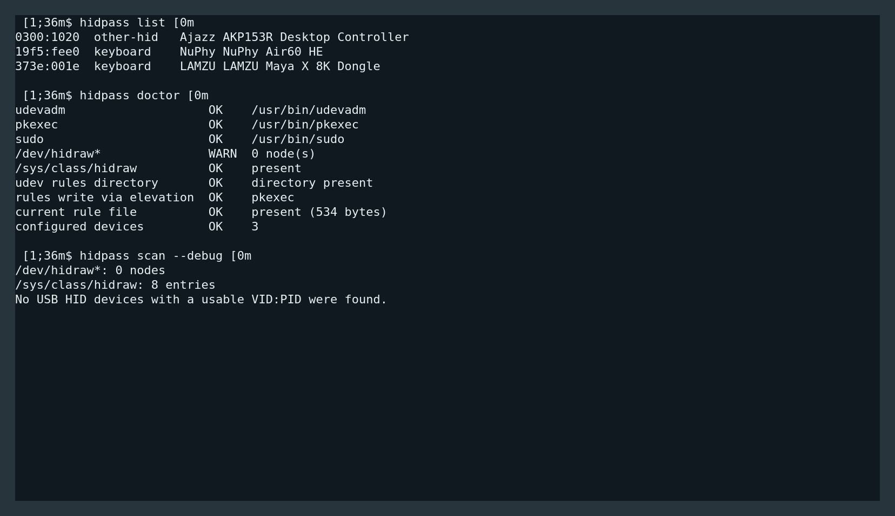

# hidpass

Безопасная Linux-утилита, которая находит подключённые USB/HID-устройства и
создаёт для выбранных устройств точечные udev-правила доступа к `/dev/hidraw*`.

Подходит для клавиатур, мышей, Stream Deck и других конфигураторов WebHID.
Ручной поиск VID/PID и запуск всей программы через `sudo` не нужны.



## Установка

### Готовый бинарник

1. Откройте [последний Release](https://github.com/MixaDoDs/hidpass/releases/latest).
2. Скачайте `hidpass-linux-amd64`.
3. Выполните:

   ```bash
   chmod +x hidpass-linux-amd64
   sudo install -m 0755 hidpass-linux-amd64 /usr/local/bin/hidpass
   ```

4. Проверьте установку:

   ```bash
   hidpass doctor
   hidpass scan
   ```

### Сборка из исходников

```bash
git clone https://github.com/MixaDoDs/hidpass.git
cd hidpass
go test ./...
go build -trimpath -o hidpass ./cmd/hidpass
sudo install -m 0755 hidpass /usr/local/bin/hidpass
```

## Быстрый старт

```bash
hidpass scan
hidpass auto
```

`auto` покажет найденные устройства и спросит подтверждение для каждого.
Запись правил выполняется через стандартное окно Polkit (`pkexec`) или через
`sudo` как запасной вариант. Само сканирование root-доступа не требует.

Полезные команды:

```bash
hidpass scan --debug   # подробная диагностика udev/sysfs
hidpass list           # разрешённые устройства
hidpass auto --yes     # добавить все подходящие устройства
hidpass remove 373e:001e
hidpass apply
hidpass doctor
```

Подробное описание архитектуры, безопасности, тестов и udev находится в
[расширенной документации](docs/README.ru.md).

## Безопасность

`hidpass` создаёт только точечные правила с `TAG+="uaccess"` и не использует
глобальный `MODE="0666"`. YubiKey/FIDO, Ledger, Trezor, Nitrokey и другие
security-устройства не добавляются автоматически.

Состояние хранится в `/etc/hidpass/devices.json`, правила — в
`/etc/udev/rules.d/70-hidpass.rules`.

## Лицензия

Лицензия пока не добавлена.
