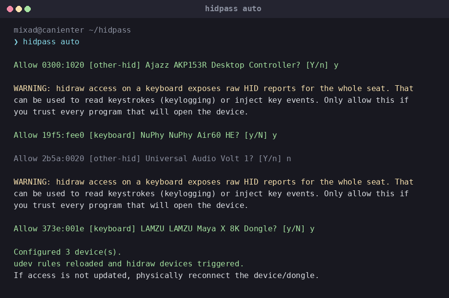

# hidpass

Нужен, чтобы VIA, NuPhy, Stream Deck и прочие WebHID-штуки на Linux
увидели клавиатуру или макропад.

Браузер хочет `/dev/hidraw*`. Система это не даёт. hidpass находит
подключённые устройства, спрашивает какие разрешить и пишет для них
udev-правило. Дальше доступ есть у тебя в сессии, не у всего компьютера.



```bash
hidpass auto
```

На каждый девайс вопрос: `y` или `n`. Клавиатуру по умолчанию не добавит —
надо явно согласиться. YubiKey и другие ключи пропускает сам.

Если в браузере после этого пусто — выдерни USB и воткни снова.

Скачать: [релиз](https://github.com/MixaDoDs/hidpass/releases/latest).
Поставить: `sudo install -m 0755 hidpass-linux-amd64 /usr/local/bin/hidpass`

[MIT](LICENSE) · [подробности](docs/README.ru.md)
