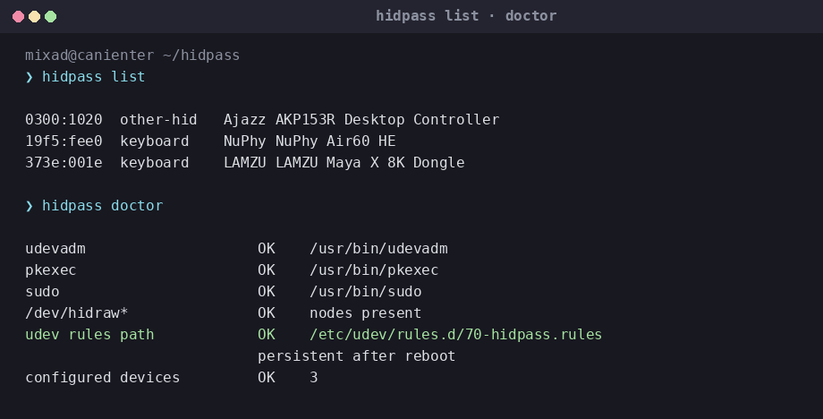

# hidpass

Браузеру и утилитам вроде VIA, NuPhy, Stream Deck нужен WebHID.
На Linux это файл `/dev/hidraw*`, и по умолчанию он закрыт.

Частый «фикс» — `chmod 666` на все hidraw. Так делать нельзя:
любая программа на сессии читает сырые нажатия.

hidpass спрашивает, каким **конкретным** устройствам можно, и пишет
одно udev-правило на каждый VID:PID. Не на весь компьютер.
Правила лежат в `/etc` — после ребута они на месте.


## Поставить

Скачай `hidpass-linux-amd64` из [последнего релиза](https://github.com/MixaDoDs/hidpass/releases/latest).
В описании релиза есть SHA-256 — сверь до установки. Не совпало, не ставь.

```bash
chmod +x hidpass-linux-amd64
sha256sum hidpass-linux-amd64
sudo install -m 0755 hidpass-linux-amd64 /usr/local/bin/hidpass
hidpass doctor
```

Из исходников:

```bash
git clone https://github.com/MixaDoDs/hidpass.git
cd hidpass
make test
make build
sudo make install   # бинарь + polkit-политика org.hidpass.apply
```

## Как пользоваться

Воткни устройство и:

```bash
hidpass scan    # что система вообще видит
hidpass auto    # разрешить по одному, с вопросом
hidpass list    # что уже прописано
```



`scan` без root. Запись правил — обычное окно polkit (или sudo).

Как отвечать в `auto`:

| Что на экране | Enter значит |
| --- | --- |
| макропад, Stream Deck, `[Y/n]` | да |
| клавиатура или мышь, `[y/N]` | **нет** |
| `Skip … security device` | hidpass сам прошёл (YubiKey, FIDO, Ledger…) |

Клавиатуру он специально не добавляет молча: hidraw на ней — это сырые
репорты на весь сеанс (кейлог и инъекция клавиш). Если надо VIA/прошивку —
напиши `y` руками.

Если в браузере после `auto` тишина — выдерни USB и воткни снова.
udev не всегда обновляет доступ на уже подключённой ноде.

## Команды

| Команда | Зачем |
| --- | --- |
| `hidpass scan` | Найти устройства |
| `hidpass scan --debug` | То же + udev/sysfs, если пусто |
| `hidpass auto` | Спросить и прописать |
| `hidpass auto --yes` | Прописать всё, кроме security-ключей (клавиатуры всё равно с варнингом) |
| `hidpass allow 373e:001e` | Добавить конкретный VID:PID, даже security-ключ |
| `hidpass remove 373e:001e` | Убрать |
| `hidpass list` | Что в конфиге |
| `hidpass apply` | Пересобрать правила |
| `hidpass doctor` | Проверить udev, polkit, путь правил |
| `hidpass uninstall` | Снять правила и `/etc/hidpass/devices.json` |

## Что он не ломает

- Нет `MODE="0666"`. Только `TAG+="uaccess"` на выбранные VID:PID.
- Файл правил: `/etc/udev/rules.d/70-hidpass.rules`, не `/run`. Ребут не съест.
- `udevadm trigger` только на hidraw, не по всему компьютеру.
- YubiKey/FIDO сами не добавятся. Явно — только `hidpass allow VID:PID`.

Конфиг: `/etc/hidpass/devices.json`.

Подробности (discovery, polkit, тесты): [docs/README.ru.md](docs/README.ru.md).

## Лицензия

[MIT](LICENSE)
