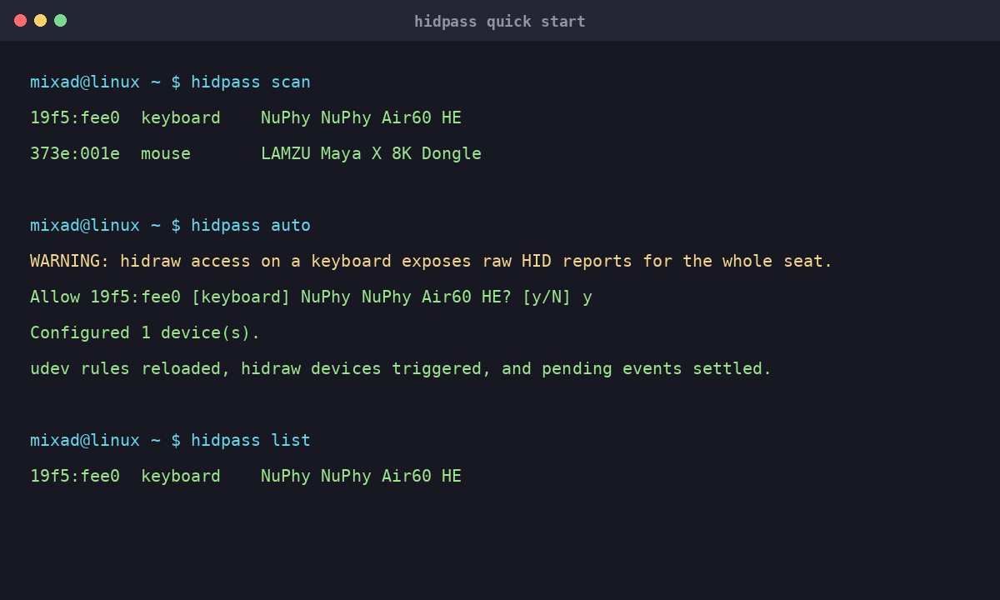

# hidpass

Give Linux USB HID devices the access they need for WebHID, keyboard configurators, firmware tools, and desktop utilities.

Linux applications usually cannot open `/dev/hidraw*` directly. `hidpass` scans connected USB HID devices, shows what it found, and creates a focused udev rule for the devices you approve.

It works with USB keyboards, mice, QMK/VIA devices, NuPhy and Keychron keyboards, Stream Decks, macro pads, and other HID hardware. Bluetooth devices are ignored.

## Screenshots

### Quick start



### Interactive device selection


### Configured devices


## Install

Download `hidpass-linux-amd64` from the [latest release](https://github.com/MixaDoDs/hidpass/releases/latest), then install it:

```bash
chmod +x hidpass-linux-amd64
sudo install -m 0755 hidpass-linux-amd64 /usr/local/bin/hidpass
hidpass doctor
```

The release also includes a SHA-256 checksum file.

To build from source:

```bash
git clone https://github.com/MixaDoDs/hidpass.git
cd hidpass
make test
sudo make install
```

## Quick start

Connect a USB HID device, then run:

```bash
hidpass scan
hidpass auto
hidpass list
```

`auto` asks before granting access. Keyboards and mice default to **No** because raw HID access can expose reports for the whole seat, including keystrokes or pointer events. Use `--yes` only when you understand the implications.

After the rules are applied, reconnect the device if the browser or configuration tool still cannot see it.

## Commands

| Command | Description |
| --- | --- |
| `hidpass scan` | Find and classify connected USB HID devices |
| `hidpass scan --debug` | Show udev and sysfs diagnostics |
| `hidpass auto` | Select devices interactively |
| `hidpass auto --yes` | Allow eligible devices without prompts |
| `hidpass allow VID:PID` | Explicitly allow one device |
| `hidpass list` | Show configured devices |
| `hidpass remove VID:PID` | Remove one device from the configuration |
| `hidpass apply` | Rebuild the rules and reload udev |
| `hidpass uninstall` | Remove hidpass rules and saved state |
| `hidpass doctor` | Check the local hidraw and udev setup |
| `hidpass version` | Print the installed version |

Example:

```bash
hidpass allow 19f5:fee0
hidpass remove 19f5:fee0
```

`19f5:fee0` is the USB ID used by the NuPhy Air60 HE.

## How it works

1. `hidpass` starts with the available `/dev/hidraw*` nodes.
2. It reads udev properties and resolves the corresponding sysfs device.
3. Multiple HID interfaces from one physical USB device are grouped together.
4. Bluetooth HID devices behind USB adapters are rejected.
5. Approved VID:PID pairs are written to `/etc/udev/rules.d/70-hidpass.rules`.
6. udev rules are reloaded, the relevant devices are triggered, and `udevadm settle` waits for the events to finish.

Security keys and hardware wallets such as YubiKey, FIDO, Ledger, Trezor, and Nitrokey devices are skipped by `auto`. An explicit `allow VID:PID` command is still available for unusual hardware.

## Development

```bash
go test ./...
go vet ./...
make build
./bin/hidpass version
```

The test suite covers device discovery, sysfs fallback, HID classification, duplicate interface handling, Bluetooth filtering, state validation, udev rule generation, privilege checks, and transactional installation.

For the detailed Russian documentation, see [`docs/README.ru.md`](docs/README.ru.md).

## License

MIT
